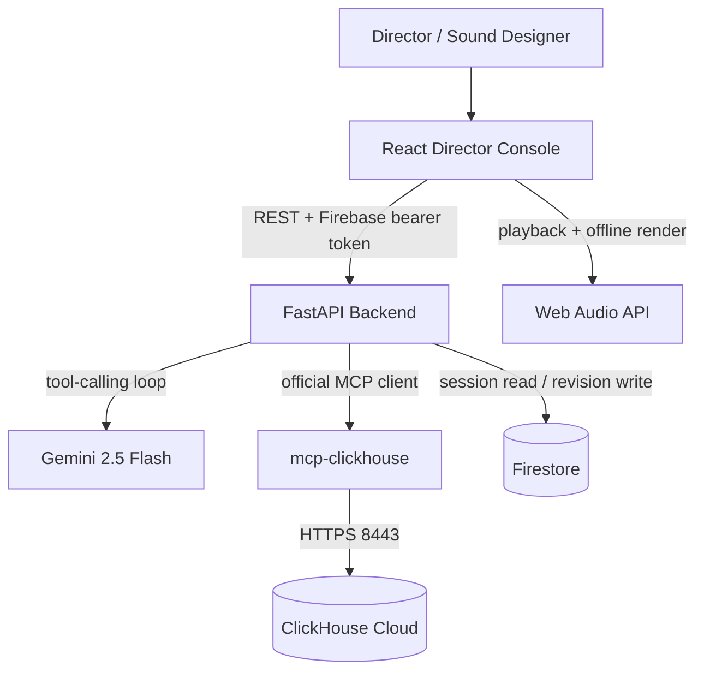

# VoltraPROD

**AI-directed sound rehearsal for film and video production**

VoltraPROD is a web-based sound rehearsal studio built for the **Agentic Cinema: The Blockbuster Hackathon — ClickHouse track**.

A director can describe what a scene should feel like in plain English. The agent inspects the current session, searches a real sound catalog through the official ClickHouse MCP server, and proposes a bounded set of timeline edits. The director can audition the result, accept it, or reject it and ask for another treatment.

**Live project:** https://sound-rehearsal.onrender.com

## Why we built it

Sound design is often a slow loop of searching, dragging clips onto a timeline, trimming them, adjusting levels, auditioning, and repeating. VoltraPROD keeps the human decision at the center but gives the repetitive search-and-placement work to an agent.

The goal is not to generate a finished soundtrack automatically. The goal is to make rehearsal faster while keeping every proposed edit visible, reversible, and constrained.

## What it does

- Accepts creative direction in natural language.
- Uses **Gemini** to reason about the current scene and decide which tools to call.
- Uses the official **`mcp-clickhouse`** server at runtime to search the sound catalog stored in ClickHouse Cloud.
- Places real catalog assets on `foley`, `sfx`, or `ambience` tracks.
- Protects the dialogue track from agent edits.
- Keeps cue timing, trims, gain, pan, and track placement inside validated bounds.
- Stores session revisions in Firestore with optimistic revision checks.
- Supports audition, accept, reject, and re-direct loops.
- Uses the Web Audio API for deterministic browser playback and offline WAV rendering.
- Serves the full web application from one production deployment on Render.

## A direction turn, end to end

1. The director writes a direction such as: `Build suspense with heavy footsteps before the turn. Keep the paper handling subtle.`
2. VoltraPROD inspects the current Firestore session and revision.
3. Gemini decides which tools it needs.
4. The agent queries the ClickHouse catalog through the official ClickHouse MCP server.
5. Gemini selects only asset IDs returned by the catalog search and proposes a concrete edit batch.
6. The backend validates the proposed cues and protected-track rules.
7. The browser renders the treatment on the timeline for audition.
8. The director accepts it or rejects it and asks for a different treatment.

The agent does not silently modify the protected dialogue track, and it does not invent catalog asset IDs.

## Hackathon runtime stack

| Layer | Technology | Role in VoltraPROD |
| --- | --- | --- |
| AI agent | Gemini 2.5 Flash via `google-genai` | Interprets direction and performs tool-calling |
| Partner integration | ClickHouse Cloud + official `mcp-clickhouse` | Runtime sound-catalog search and recall |
| Agent service | FastAPI / Python | Validates requests, runs the tool loop, applies domain safeguards |
| Session state | Firebase Firestore | Session revisions, cues, and optimistic locking |
| Authentication | Firebase Auth | Browser authentication for hosted sessions |
| Frontend | React + TypeScript | Director console, timeline, stage preview, audition controls |
| Audio engine | Web Audio API | Playback scheduling, gain, pan, cue cancellation, offline rendering |
| Hosting | Render | Public production deployment |

No non-Google AI model or third-party AI API is used by the project runtime.

## Architecture



### Runtime proof in the repository

The partner and Google integrations are not README-only references:

- `backend/app/agent.py` calls Gemini through the `google-genai` SDK and exposes the sound, recall, session-inspection, and edit-batch tools to the model.
- `backend/app/mcp_client.py` starts and communicates with the official `mcp-clickhouse` server and calls its `run_query` tool.
- `backend/app/tools.py` turns MCP query results into sound candidates the agent can actually select.
- `backend/app/firestore_store.py` persists authoritative session revisions.
- `frontend/src/audio/engine.ts` schedules the accepted cue treatment in the browser.

## Safety and failure behavior

VoltraPROD is deliberately strict about what the agent can change.

- `dialogue` is a protected track.
- Agent-editable tracks are limited to `foley`, `sfx`, and `ambience`.
- Gain is clamped to the supported range.
- Pan is limited to the stereo range.
- Source in/out points are checked against the actual catalog asset duration.
- Stale edit batches are rejected through revision checks.
- Rejected asset IDs can be excluded from the next direction turn.
- If Gemini is temporarily unavailable or rate-limited, the backend reports the failure instead of fabricating a treatment.
- If an external integration is unavailable, the application keeps the failure explicit so the director can continue with manual audition and editing where possible.

Imported media is handled primarily in the browser for playback and editing. When scene-aware direction is used, the application may send the user-supplied scene description and an optional captured video keyframe to the backend/Gemini for alignment.

## Project structure

```text
VoltraPROD/
├── assets/                     # Demo media and attribution information
├── backend/
│   ├── app/
│   │   ├── agent.py            # Gemini tool-calling loop
│   │   ├── auth.py             # Firebase token verification
│   │   ├── config.py           # Environment/configuration model
│   │   ├── event_sink.py       # Audition/event telemetry
│   │   ├── firestore_store.py  # Authoritative session revision store
│   │   ├── main.py             # FastAPI application and SPA host
│   │   ├── mcp_client.py       # Official ClickHouse MCP runtime client
│   │   ├── models.py           # Domain models and bounds
│   │   └── tools.py            # Agent-facing tools
│   ├── pyproject.toml
│   └── requirements.lock
├── frontend/
│   └── src/
│       ├── audio/               # Browser playback and offline render engine
│       ├── components/          # Stage, timeline, direction console
│       ├── api.ts
│       ├── firebase.ts
│       └── App.tsx
├── scripts/                     # Preflight, catalog setup, workflow proof
├── sql/                         # ClickHouse schema
├── tests/                       # Backend/domain tests
├── Dockerfile
├── render.yaml
└── LICENSE
```

## Run locally

### Requirements

- Python 3.11+
- Node.js 20+
- A Google API key with Gemini access
- A ClickHouse Cloud cluster
- Firebase / Firestore credentials

### 1. Configure the environment

```bash
cp .env.example .env
```

Set at least:

```text
GOOGLE_API_KEY=
GEMINI_MODEL=gemini-2.5-flash
CLICKHOUSE_HOST=
CLICKHOUSE_PORT=8443
CLICKHOUSE_USER=
CLICKHOUSE_PASSWORD=
CLICKHOUSE_DATABASE=default
FIREBASE_PROJECT_ID=
FIREBASE_CLIENT_EMAIL=
FIREBASE_PRIVATE_KEY=
FIREBASE_WEB_API_KEY=
```

Do not commit real credentials.

### 2. Install the backend

Using `uv`:

```bash
uv venv .venv --python 3.12
uv pip install -r backend/requirements.lock
```

Activate the environment for your platform, then run:

```bash
python -m pytest tests -v
```

### 3. Build the frontend

```bash
cd frontend
npm install
npm run build
cd ..
```

### 4. Start VoltraPROD

```bash
python -m uvicorn backend.app.main:app --host 0.0.0.0 --port 8000
```

Open `http://localhost:8000`.

## Production deployment

The repository includes a multi-stage `Dockerfile` and `render.yaml` for the hosted build.

Render needs the same production credentials described above. The service exposes `/health` for deployment health checks and serves the compiled React frontend from the FastAPI application.

## What we learned

Three decisions mattered most while building VoltraPROD:

1. **An agent is more useful when it proposes edits instead of hiding them.** A director should be able to see exactly what changed before accepting it.
2. **MCP gives the model a real catalog instead of imaginary assets.** The agent has to search ClickHouse and work with returned asset IDs.
3. **Revision control belongs in the creative loop.** Once multiple agent turns and human decisions are involved, stale edits need to fail safely instead of overwriting the current session.

That combination made the project feel less like a chatbot beside a timeline and more like a rehearsal assistant that works inside the production workflow.

## Hackathon alignment

VoltraPROD is submitted to the **ClickHouse partner track** of Agentic Cinema.

- Functional hosted web project: included above.
- Google AI used at runtime: Gemini through `google-genai`.
- Partner technology used at runtime: official `mcp-clickhouse` connected to ClickHouse Cloud.
- Public source repository: this repository.
- Run instructions and required environment variables: included above.
- Open-source license: MIT, in the repository root.

## License

VoltraPROD source code is released under the [MIT License](LICENSE).
